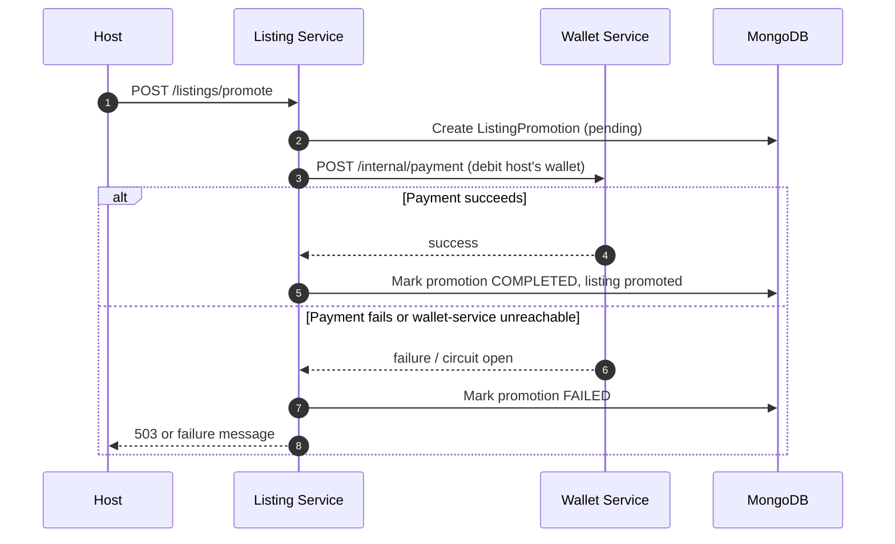
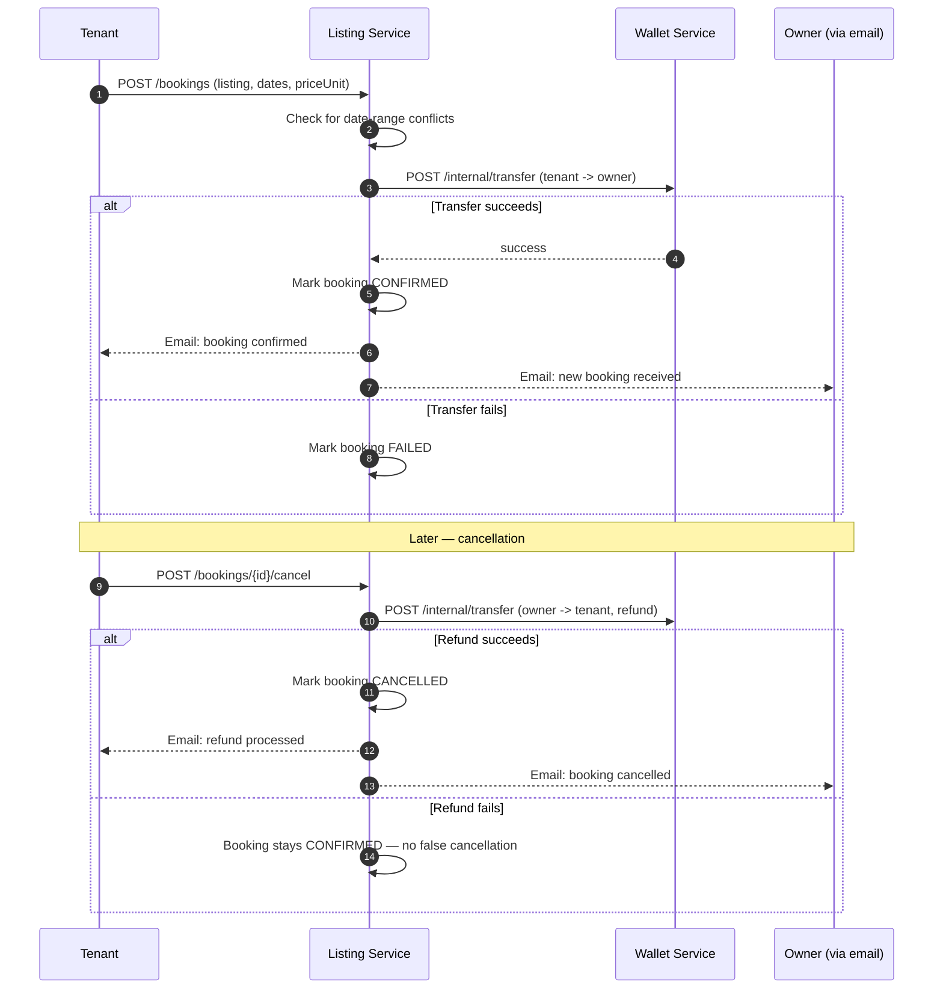

<p align="center">
  
</p>

<h1 align="center">Premisave Listing Service: Real Estate Listings, Bookings &amp; Ad Promotion API</h1>

<p align="center">
  <b>A production-minded Spring Boot 4 &amp; MongoDB microservice that powers listing management, short-term rental bookings, lead capture, and paid ad promotion for the Premisave real estate platform.</b>
</p>

<p align="center">
  <a href="https://github.com/peacemakerbill">
    
  </a>
  <br/>
  <sub>Built by <a href="https://github.com/peacemakerbill"><b>Bill Graham Peacemaker</b></a> (<code>@peacemakerbill</code>) · Backend Developer &amp; API Support Engineer · Nairobi, Kenya</sub>
</p>

<p align="center">
  
  
  
  
  
  
</p>

<p align="center">
  
  
  
  
  
</p>

<p align="center">
  <a href="https://github.com/peacemakerbill/premisave-listing-service/stargazers"></a>
  <a href="https://github.com/peacemakerbill/premisave-listing-service/network/members"></a>
  <a href="https://github.com/peacemakerbill/premisave-listing-service/issues"></a>
  <a href="https://github.com/peacemakerbill/premisave-listing-service/commits"></a>
  
  
  
</p>

<p align="center">
  <a href="#quick-start">Quick start</a> ·
  <a href="#architecture">Architecture</a> ·
  <a href="#how-ad-promotion-works">How ad promotion works</a> ·
  <a href="#how-bookings-work">How bookings work</a> ·
  <a href="#api-reference">API reference</a> ·
  <a href="#configuration-reference">Configuration</a> ·
  <a href="#troubleshooting">Troubleshooting</a>
</p>

> **If this saves you time building a Spring Boot listings/booking backend, please star the repo.** It helps other Kenyan fintech and proptech developers find it.

> **Disclaimer.** This is an independent, community-built project shared as a portfolio and reference implementation. It is not affiliated with or endorsed by any third-party service it integrates with. Always follow each provider's own current documentation for onboarding and go-live requirements.

---

## Table of contents

1. [What is this?](#what-is-this)
2. [Features](#features)
3. [Listing categories](#listing-categories)
4. [Architecture](#architecture)
5. [How ad promotion works](#how-ad-promotion-works)
6. [How bookings work](#how-bookings-work)
7. [Lead capture (listing interest)](#lead-capture-listing-interest)
8. [Currency model](#currency-model)
9. [Quick start](#quick-start)
10. [Build and run](#build-and-run)
11. [Configuration reference](#configuration-reference)
12. [API reference](#api-reference)
13. [Testing with Postman or curl](#testing-with-postman-or-curl)
14. [Rate limiting](#rate-limiting)
15. [Data model](#data-model)
16. [Going live](#going-live)
17. [Security notes](#security-notes)
18. [Project structure](#project-structure)
19. [Troubleshooting](#troubleshooting)
20. [Roadmap ideas](#roadmap-ideas)
21. [Contributing](#contributing)
22. [Author](#author)

---

## What is this?

**Premisave Listing Service** is the real estate catalog and transaction backbone of the Premisave platform: a Java Spring Boot microservice that lets home owners list short-term rentals, long-term rentals, leases, land, and houses for sale, and lets customers browse, book, and express interest in them.

It does not move money on its own — it delegates every wallet debit, credit, and transfer to the sibling `wallet-service`, and every identity/profile lookup to the sibling `auth-service` — but it owns the domain logic that decides *when* money should move: a promotion payment when a host boosts a listing, a tenant-to-owner payment when a short-term booking is confirmed, and an owner-to-tenant refund when that booking is cancelled.

It:

- exposes one listings API across five property categories, each with its own fields, behind a shared base contract for search, filtering, and pagination,
- lets a host pay to promote a listing (a wallet-service debit) for a configurable daily rate, with a scheduled sweep that expires promotions automatically,
- lets a customer book a short-term rental — by day, by night, or a listing can offer both — paying the owner directly via a wallet-to-wallet transfer, with date-conflict checking and a full refund on cancellation,
- lets a customer express interest in a long-term rental, lease, or sale without any money changing hands, giving the owner a lead to follow up on,
- sends HTML email notifications for every one of those state changes, to both parties, and
- never stores a person's mutable profile data (name, phone, address, photo) — only their stable user ID and email are kept; everything else is fetched live from `auth-service` on every response, so it can never go stale.

It was built for the Premisave platform's own microservice ecosystem (alongside `auth-service` and `wallet-service`), and recently upgraded to Spring Boot 4.1.1 / Spring Framework 7.

## Features

| | |
|---|---|
| **Five listing categories, one API** | Short-term rentals, long-term rentals, leases, land sales, and house sales — each with category-specific fields, searchable and filterable through a shared endpoint. |
| **Short-term rental bookings** | Day and/or night pricing per listing, date-conflict checking, tenant-pays-owner via wallet transfer, full refund on cancellation, and a scheduled job that marks past-checkout bookings complete. |
| **Ad promotion** | Pay a configurable daily rate to feature a listing; extend an active promotion; a scheduled sweep automatically deactivates expired ones. |
| **Lead capture (listing interest)** | No-money "contact me" flow for long-term rentals, leases, and sales — the owner gets the lead's contact details, fetched live rather than stored. |
| **Live currency display** | Scheduled background refresh from the Frankfurter API, USD-based, for browsing listings in other currencies. |
| **HTML email notifications** | Booking confirmed/cancelled, interest expressed/cancelled — sent to both parties, Thymeleaf-rendered, styled to match the platform's wallet-service emails. |
| **Tiered, distributed rate limiting** | Redis-backed via Bucket4j, per authenticated user or IP, with separate budgets for ordinary browsing, listing writes, and money-moving/lead-generating actions. |
| **Circuit-breaker-protected integrations** | Every call to `auth-service` and `wallet-service` goes through a Feign client with a Resilience4j circuit breaker and an explicit fallback, so a dependency outage fails cleanly instead of hanging. |
| **Admin listing management** | Role-gated (`ADMIN`/`FINANCE`) endpoints for moderating listings across the whole platform. |
| **Image hosting via Cloudinary** | Multipart listing image uploads, content-type validated before upload. |
| **OpenAPI 3 documentation** | Full API spec generation via springdoc-openapi (disabled by default in production). |

## Listing categories

| Category | Distinguishing fields |
|---|---|
| **Short-term rental** | `pricePerDay` and/or `pricePerNight`, max guests, bedrooms, bathrooms, amenities, Wi-Fi/kitchen flags. |
| **Long-term rental** | Minimum lease months, furnished flag, tenant requirements. |
| **Lease** | Lease duration, deposit amount, lease terms, renewable flag. |
| **Land sale** | Size in acres, land use type, title deed status. |
| **House sale** | Floors, plot size, garage, property type. |

Every category also carries a `priceUnit` (`PER_NIGHT`, `PER_DAY`, `PER_MONTH`, or `TOTAL`) so a listing's price is never ambiguous about what it actually means — resolved automatically per category if the host doesn't specify one.

## Architecture

```
┌──────────────┐      JWT       ┌────────────────────────┐
│   End User   │ ─────────────► │                        │
└──────────────┘                │                        │      ┌─────────────┐
                                 │  Premisave Listing     │ ───► │ auth-service│
┌──────────────┐  JWT forward   │      Service            │      │ (identity,  │
│ auth-service │ ◄────────────► │  (this repository)     │      │  profiles)  │
├──────────────┤                │                        │      └─────────────┘
│wallet-service│ ◄── X-API-Key ►│  MongoDB <-> Redis     │      ┌─────────────┐
└──────────────┘                │                        │ ───► │wallet-service│
                                 │                        │      │ (money      │
                                 └────────────────────────┘      │  movement)  │
                                          │        │              └─────────────┘
                                          ▼        ▼
                                   Cloudinary   Frankfurter API
                                   (images)     (currency rates)
```

**Design choices**

- **This service decides *when* money should move; wallet-service is the only thing that actually moves it.** Promotions call wallet-service's `/internal/payment` (debit for a service charge); bookings call `/internal/transfer` (direct wallet-to-wallet). Neither ever touches a payment gateway directly.
- **Two different trust models for two different Feign clients.** Calls to `auth-service` forward the caller's own JWT — identity checks there are always "is this really who they claim to be." Calls to `wallet-service` use a static, shared internal API key — that trust boundary authenticates the *calling service*, not the end user.
- **No cached personal data.** `Booking` and `ListingInterest` store only a user's ID and email — full name, phone, address, and profile picture are fetched fresh from `auth-service` every time a response is built. If `auth-service` is unreachable when that fetch happens, the request fails with a clear error rather than returning stale or incomplete data.
- **A refund only ever completes after the money actually moves.** If a booking cancellation's wallet-service transfer fails, the booking stays `CONFIRMED`, not `CANCELLED` — the state never claims a refund happened before it did.

## How ad promotion works



A scheduled job (`AdPromotionService.deactivateExpiredPromotions`, every 5 minutes by default) sweeps `COMPLETED` promotions whose end date has passed and deactivates them — a listing is never left showing as promoted after it should have expired.

## How bookings work



A separate scheduled job (`BookingService.completeExpiredBookings`, every 5 minutes by default) marks `CONFIRMED` bookings `COMPLETED` once their checkout date has passed — keeping "my active bookings" views accurate without affecting the date-conflict logic itself, which already excludes past bookings by date comparison alone.

## Lead capture (listing interest)

For categories where an instant, priced booking doesn't make sense — long-term rentals, leases, land, and house sales — a customer can express interest instead. No money moves. `ListingInterestService` records only the customer's stable ID and email, then fetches their full contact details live from `auth-service` whenever a response is built for the *owner's* side, and the owner's details for the *customer's* side — each party only ever sees the other party's information, never an echo of their own. Cancelling interest deletes the record entirely; there's no retained history of past leads once withdrawn.

## Currency model

- **USD is the base currency** for both listing prices and everything wallet-service settles in.
- **`CurrencyService`** fetches live rates from the [Frankfurter API](https://www.frankfurter.dev/), refreshed on a schedule and cached in Redis, so converting a listing's price for display never costs a live API call on the request path.
- Currency conversion here is **display-only** — actual payment settlement (promotions, bookings) always happens in USD through wallet-service, which has its own settlement currency model.

## Quick start

### Prerequisites

- **Java 21**
- **Maven 3.9+**
- **MongoDB** running locally, in Docker, or on Atlas
- **Redis** running locally or hosted (rate limiting and currency-rate caching)
- Running instances of `auth-service` and `wallet-service` (or their sandbox equivalents) for full functionality
- SMTP credentials (any provider) for email notifications
- A Cloudinary account for image hosting

```bash
# 1. Clone
git clone https://github.com/peacemakerbill/premisave-listing-service.git
cd premisave-listing-service

# 2. Start MongoDB and Redis (skip if you already have them)
docker run -d --name listing-mongo -p 27017:27017 mongo:8
docker run -d --name listing-redis -p 6379:6379 redis:7

# 3. Create your .env (see the next section), then run
mvn spring-boot:run
```

Create a `.env` file next to `pom.xml`:

```properties
# Core
MONGODB_URI=mongodb://localhost:27017/premisave-listing
REDIS_HOST=localhost
REDIS_PORT=6379
JWT_SECRET=<a long, random secret shared with auth-service>
INTERNAL_SERVICE_API_KEY=<a shared secret, identical across every Premisave microservice>

# Sibling services
AUTH_SERVICE_URL=http://localhost:8080
WALLET_SERVICE_URL=http://localhost:8084

# Image hosting
CLOUDINARY_CLOUD_NAME=...
CLOUDINARY_API_KEY=...
CLOUDINARY_API_SECRET=...

# Email
MAIL_HOST=smtp.gmail.com
MAIL_PORT=587
MAIL_USERNAME=...
MAIL_PASSWORD=...
```

> **Important:** `INTERNAL_SERVICE_API_KEY`, `JWT_SECRET`, the Cloudinary credentials, and the mail credentials all have **no default value** — the app fails to start rather than silently run with a placeholder. This is deliberate: a wrong-but-present placeholder here has previously caused confusing 401s and misdirected emails at *request* time instead of a clear failure at startup.

When the service is healthy you will see lines like:

```
Tomcat started on port 8082 (http) with context path '/'
Exchange rates refreshed: 166 currencies cached from Frankfurter (base=USD).
```

## Build and run

```bash
# Compile and package an executable jar
mvn clean package

# Run it (environment variables or a .env in the working directory)
java -jar target/premisave-listing-service-0.0.1-SNAPSHOT.jar
```

**Notes**

- `.env` is loaded from the working directory. Real environment variables (Docker, Kubernetes, systemd) also work and take precedence over `.env`.
- The service starts on **port 8082** by default (`server.port` in `application.yml`).
- Recently upgraded to **Spring Boot 4.1.1** — if building from source, note that `spring-boot-starter-web` is now `spring-boot-starter-webmvc`, and a `spring-boot-jackson2` compatibility module is required alongside `spring.http.converters.preferred-json-mapper: jackson2`, since several parts of this codebase (security config, the rate limiter, Feign's own converters) still expect a Jackson 2 `ObjectMapper` bean rather than Boot 4's default Jackson 3 `JsonMapper`.

## Configuration reference

Every setting lives in `src/main/resources/application.yml` and can be overridden by an environment variable or `.env`.

| Environment variable | Default | Required | Description |
|---|---|---|---|
| `MONGODB_URI` | `mongodb://localhost:27017/premisave-listing` | no | MongoDB connection string. |
| `REDIS_HOST` / `REDIS_PORT` | `localhost` / `6379` | no | Redis connection for rate limiting and currency-rate caching. |
| `JWT_SECRET` | none | **yes** | Must match every other Premisave service validating the same tokens. |
| `INTERNAL_SERVICE_API_KEY` | none | **yes** | Shared secret every Premisave microservice presents as `X-API-Key` for service-to-service calls — same value across the whole platform. |
| `AUTH_SERVICE_URL` | `http://localhost:8080` | no | Base URL of auth-service. |
| `WALLET_SERVICE_URL` | `http://localhost:8084` | no | Base URL of wallet-service. |
| `CLOUDINARY_CLOUD_NAME` / `CLOUDINARY_API_KEY` / `CLOUDINARY_API_SECRET` | none | **yes** | Cloudinary credentials for listing image uploads. |
| `MAIL_HOST` / `MAIL_PORT` / `MAIL_USERNAME` / `MAIL_PASSWORD` | none | **yes** | SMTP credentials for booking/interest notification emails. |
| `MAIL_FROM` | `no-reply@premisave.com` | no | The "From" address on every notification email. |
| `FRANKFURTER_BASE_URL` | `https://api.frankfurter.dev` | no | Currency-rate API base URL. |
| `FRONTEND_URL` | `http://localhost:3000` | no | Allowed CORS origin, and the fallback if `CORS_ALLOWED_ORIGINS` is unset. |
| `CORS_ALLOWED_ORIGINS` | falls back to `FRONTEND_URL` | no | Comma-separated list of allowed origins. |

Rate-limit tiers, promotion pricing, and the scheduled-job cron expressions are all tunable directly in `application.yml` (`rate-limit.*`, `ad.promotion.*`, `booking.completion-check-cron`) — see the file itself for the full set, each documented inline.

The service **refuses to start** if `JWT_SECRET`, `INTERNAL_SERVICE_API_KEY`, the Cloudinary credentials, or the mail credentials are missing, by design.

## API reference

Base URL (local): `http://localhost:8082`

| Namespace | Auth | Purpose |
|---|---|---|
| `/listings/**` | Mixed — browsing is public, writes require a JWT with `HOME_OWNER` role | Listing CRUD, search, promotion |
| `/bookings/**` | JWT | Short-term rental booking and cancellation |
| `/interests/**` | JWT | Lead capture: express/cancel interest |
| `/currency/**` | Public | Display-only currency conversion |
| `/admin/**` | JWT (`ADMIN`/`FINANCE` roles) | Cross-platform listing moderation |
| `/social/**` | JWT | Pass-through proxy to auth-service's social features |

### `POST /listings/promote`: promote a listing

| | |
|---|---|
| **Header** | `Authorization: Bearer <JWT>` |

```json
{
  "listingId": "6a8f4a873fdf5d2d54072cb2",
  "days": 7
}
```

### `POST /bookings`: book a short-term rental

| | |
|---|---|
| **Header** | `Authorization: Bearer <JWT>` |

```json
{
  "listingId": "6a8f4a873fdf5d2d54072cb2",
  "checkIn": "2026-10-10T14:00:00",
  "checkOut": "2026-10-13T11:00:00",
  "priceUnit": "PER_NIGHT"
}
```

Response includes both parties' details, fetched live:

```json
{
  "id": "6a9f1b2c3d4e5f6789012345",
  "status": "CONFIRMED",
  "totalAmount": 165.00,
  "currency": "USD",
  "success": true,
  "tenant": { "fullName": "...", "email": "...", "phoneNumber": "...", "...": "..." },
  "owner": { "fullName": "...", "email": "...", "phoneNumber": "...", "...": "..." }
}
```

### `POST /interests`: express interest in a listing

| | |
|---|---|
| **Header** | `Authorization: Bearer <JWT>` |

```json
{
  "listingId": "6a8f4eb1ed197f0d0f537650",
  "message": "Looking to move in next month, is it still available?"
}
```

### `GET /listings/search`: public listing search

| | |
|---|---|
| **Auth** | None |
| **Query** | `query`, `category`, `minPrice`, `maxPrice`, `city` — all optional |

## Testing with Postman or curl

```bash
BASE=http://localhost:8082
TOKEN="<a real JWT for a test user>"

# Search listings (public, no auth)
curl -s "$BASE/listings/search?category=SHORT_TERM_RENTAL&city=Nairobi"

# Book a short-term rental
curl -s -X POST "$BASE/bookings" \
  -H "Authorization: Bearer $TOKEN" \
  -H "Content-Type: application/json" \
  -d '{"listingId":"<listing id>","checkIn":"2026-10-10T14:00:00","checkOut":"2026-10-13T11:00:00","priceUnit":"PER_NIGHT"}'

# Express interest in a listing
curl -s -X POST "$BASE/interests" \
  -H "Authorization: Bearer $TOKEN" \
  -H "Content-Type: application/json" \
  -d '{"listingId":"<listing id>","message":"Is this still available?"}'
```

**Collection variables worth saving in Postman:** `base_url_listing`, `token`, `listing_id`, `booking_id`, `interest_id`.

## Rate limiting

Redis-backed, per authenticated user (falling back to IP for anonymous requests), split into three independent tiers so exhausting one doesn't affect the others:

| Tier | Default budget | Applies to |
|---|---|---|
| `default` | 300/min | Ordinary browsing — search, view a listing, currency rates |
| `write` | 30/min | Creating, editing, deleting listings |
| `sensitive` | 10/min | Bookings, cancellations, promotions, expressing interest — deliberately strict, since these are exactly what fraud/spam patterns target |

Every number, and the exact path patterns assigned to each tier, is configurable in `application.yml` under `rate-limit.*` — no code change needed to retune.

## Data model

| Entity | Purpose |
|---|---|
| `Listing` (base) → `ShortTermRental`, `LongTermRental`, `Lease`, `LandSale`, `HouseSale` | One collection per category, sharing a common base (title, price, owner, status, images). |
| `Booking` | A short-term rental booking: dates, `priceUnit`, `totalAmount`, `status` (`PENDING`/`CONFIRMED`/`COMPLETED`/`CANCELLED`/`FAILED`), payment/refund references. Stores only `tenantId`/`tenantEmail` and `ownerId`/`ownerEmail` — nothing else about either party. |
| `ListingInterest` | A lead: `customerId`/`customerEmail`, the listing, and an optional message. Deleted entirely on cancellation. |
| `ListingPromotion` | A paid promotion period on a listing: daily rate, currency, end date, payment status. |
| `Payment` | Local audit record of every wallet-service debit this service initiates. |

## Going live

1. **Confirm `auth-service` and `wallet-service` are both reachable** at the URLs configured — this service degrades to clear 503s rather than silent failures when either is down, but neither promotions nor bookings can complete without them.
2. **Set strong secrets** for `JWT_SECRET` and `INTERNAL_SERVICE_API_KEY`, identical across every Premisave service that needs them, kept outside git.
3. **Confirm the `recipientAccountNumber` assumption** in `WalletTransferRequest` (currently resolved as the recipient's email) against wallet-service's actual expected behavior before relying on booking payments/refunds in production.
4. **Disable Swagger/OpenAPI** (`springdoc.api-docs.enabled` / `springdoc.swagger-ui.enabled: false`) if not already off — both endpoints are public by default.
5. **Consider a distributed lock** (e.g. ShedLock) around the scheduled jobs before running more than one instance — currently each instance runs the promotion-expiry and booking-completion sweeps independently.

## Security notes

- **JWT authentication** for authenticated endpoints, validated against the platform's shared secret; public browsing endpoints (search, view a listing) require no token at all.
- **Internal API key authentication** (`X-API-Key`) for calls to wallet-service, kept entirely separate from the JWT forwarded to auth-service — the two trust boundaries never mix.
- **Role-based access control** on write operations (`HOME_OWNER`) and admin endpoints (`ADMIN`/`FINANCE`).
- **No cached personal data** — `Booking` and `ListingInterest` never store a name, phone number, address, or profile picture; both are fetched live from auth-service on every read, and the request fails cleanly if auth-service is unreachable rather than returning stale data.
- **Tiered rate limiting** via a Redis-backed token-bucket algorithm, with the strictest budget on money-moving and lead-generating actions specifically.
- **Refunds never precede the actual money movement** — a booking only becomes `CANCELLED` after its wallet-service refund transfer succeeds.
- **Stateless sessions** — no server-side session state, fully horizontally scalable (aside from the scheduled-job locking caveat above).

## Project structure

```
premisave-listing-service/
├── src/main/java/com/premisave/listing/
│   ├── config/          # Security, Redis, Mongo, Feign, Rate Limiting, Mail
│   ├── client/           # Feign clients for auth-service and wallet-service
│   ├── controller/       # REST controllers
│   ├── service/          # Listings, bookings, interest, promotions, email, currency
│   ├── entity/            # Listing subtypes, Booking, ListingInterest, Payment, ListingPromotion
│   ├── dto/              # Request/response DTOs
│   ├── enums/            # ListingCategory, BookingStatus, PriceUnit, etc.
│   ├── security/         # JWT filters
│   ├── exception/        # Custom exceptions + GlobalExceptionHandler
│   └── PremisaveListingServiceApplication.java
├── src/main/resources/
│   ├── application.yml
│   └── templates/email/   # Thymeleaf HTML email templates
└── pom.xml
```

## Troubleshooting

<details>
<summary><b>App fails to start with "No qualifying bean of type 'com.fasterxml.jackson.databind.ObjectMapper'"</b></summary>

Boot 4 defaults to Jackson 3, whose auto-configured bean is a `JsonMapper`, not a Jackson 2 `ObjectMapper`. Confirm `spring-boot-jackson2` is in `pom.xml` **and** `spring.http.converters.preferred-json-mapper: jackson2` is set in `application.yml` — the dependency alone puts Jackson 2 on the classpath but doesn't select it as the active bean. Both are required together.
</details>

<details>
<summary><b>A booking or promotion fails with "Payments are temporarily unavailable"</b></summary>

This means wallet-service is unreachable or its circuit breaker is open — check that `WALLET_SERVICE_URL` actually points at a running instance. The booking/promotion is recorded as `FAILED` for audit purposes, not silently dropped.
</details>

<details>
<summary><b>A request fails with "Authentication service is currently unavailable"</b></summary>

Same pattern, for auth-service. Any endpoint that needs live user/owner details (bookings, interests, listing creation) depends on auth-service being reachable, by design — it never falls back to stale cached data.
</details>

<details>
<summary><b>Two requests for the same listing and dates both succeed</b></summary>

Known gap — the date-conflict check and the booking creation aren't currently wrapped in a distributed lock, so two simultaneous requests can both pass the check before either saves. See [Roadmap ideas](#roadmap-ideas).
</details>

## Roadmap ideas

Real, currently-known gaps and follow-ups, not commitments:

- [ ] Distributed lock around booking date-conflict checking to close the race condition noted above
- [ ] Distributed lock (e.g. ShedLock) around the scheduled jobs before running more than one instance
- [ ] Idempotency keys for booking/promotion payments — a double-tapped request currently has no dedup protection
- [ ] Automated unit/integration test coverage — currently none, despite three separate money-movement paths
- [ ] Booking availability calendar endpoint (`GET /listings/{id}/availability`), rather than only discovering a conflict via a failed booking attempt
- [ ] Favorites/wishlist feature
- [ ] Post-stay reviews for listings specifically (the social feature reviews users, not listings)
- [ ] Category-specific search filters (bedrooms, acreage, etc.) beyond the current text/category/city/price filters
- [ ] Consolidate the five listing-category collections into one, with a category discriminator
- [ ] Geospatial (2dsphere) indexing for location-based search, replacing the current bounding-box approximation
- [ ] Full Jackson 3 migration, retiring the `spring-boot-jackson2` compatibility module (Spring's own stated stop-gap)
- [ ] Confirm the `recipientAccountNumber`-as-email assumption in `WalletTransferRequest` against wallet-service's real behavior

## Contributing

This is a proprietary service for the Premisave platform. If you have been granted access to contribute:

1. Fork the repository and create a branch: `git checkout -b feature/my-improvement`
2. Make your change and keep the code style consistent.
3. Commit with a clear message and open a pull request describing what and why.

Found a bug or have an integration question? [Open an issue](https://github.com/peacemakerbill/premisave-listing-service/issues).

## Author

<table>
  <tr>
    <td align="center" width="180">
      <a href="https://github.com/peacemakerbill">
        <br/>
        <sub><b>Bill Graham Peacemaker</b></sub>
      </a>
    </td>
    <td>
      <b>Backend Developer &amp; API Support Engineer at Safaricom PLC</b><br/>
      Nairobi, Kenya<br/><br/>
      Enterprise systems developer and API integration specialist, working across backend microservices (Java/Spring Boot), Flutter frontends, and DevOps — with deep, hands-on production and personal-project experience in Safaricom's M-Pesa Daraja APIs.<br/><br/>
      <a href="https://github.com/peacemakerbill"></a>
      <a href="https://github.com/peacemakerbill?tab=followers"></a>
      <br/><br/>
      More from me: <a href="https://github.com/peacemakerbill/premisave-wallet-service">premisave-wallet-service</a> ·
      <a href="https://github.com/peacemakerbill/premisave-c2b-hakikisha-service-m-pesa">premisave-c2b-hakikisha-service-m-pesa</a> ·
      <a href="https://github.com/peacemakerbill/premisave_auth_service">premisave_auth_service</a> ·
      <a href="https://github.com/peacemakerbill?tab=repositories">all repositories</a>
    </td>
  </tr>
</table>

### Star history

<a href="https://star-history.com/#peacemakerbill/premisave-listing-service&Date">
  
</a>

---

<details>
<summary>Search keywords</summary>

Spring Boot microservice · Java real estate backend · property listing API Java · short-term rental booking system · MongoDB Spring Boot microservice · Redis rate limiting Bucket4j · JWT authentication Spring Security 7 · microservice architecture Java · Cloudinary image upload Java · Thymeleaf HTML email templates · Frankfurter currency API · OpenFeign Resilience4j circuit breaker · wallet-service integration · real estate marketplace backend · vacation rental API · lead capture system · ad promotion system · property management backend Kenya · East Africa proptech · Premisave · Spring Boot 4 migration · Jackson 3 migration

</details>

<p align="center">
  <sub>Made in Nairobi, Kenya · <a href="https://github.com/peacemakerbill">@peacemakerbill</a></sub>
</p>